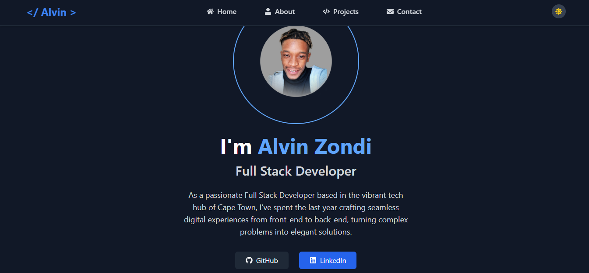

# Alvin Zondi Portfolio

A modern, responsive single-page portfolio application built with **React** and styled using **Tailwind CSS**, showcasing my full-stack development skills and professional journey.
## 🚀 Live Demo

[View Live Portfolio](https://new-portfolio-one-brown.vercel.app/)

## 📸 Screenshot

---

## 🌟 Features

- **Single Page Application**: Smooth navigation between sections without page reloads  
- **Fully Responsive**: Optimized for all devices (desktop, tablet, mobile)  
- **Dark Mode Toggle**: Seamless light/dark theme switching with user preference persistence  
- **Interactive Sections**:  
  - **Home** – Hero section with introduction and call-to-action  
  - **About** – Personal background, skills, and professional story  
  - **Projects** – Portfolio showcase with live demos and source code links  
  - **CV/Resume** – Professional experience and downloadable resume  
  - **Contact** – Contact form and social media links  

## 🛠️ Technologies Used

### Frontend
- **React.js** – Component-based UI  
- **Tailwind CSS** – Utility-first styling framework  
- HTML5 – Semantic markup  
- JavaScript (ES6+) – Interactive functionality  

### Key Features Implementation
- **Dark Mode**: State-based toggle with persistent theme storage  
- **Responsive Design**: Tailwind’s mobile-first utilities  
- **Smooth Animations**: Tailwind transitions and custom effects  
- **Form Validation**: Client-side validation for contact form  
- **Performance Optimized**: Lazy loading and optimized assets  

## 📱 Responsive Design

- **Mobile**: 320px - 768px (Touch-optimized navigation)  
- **Tablet**: 768px - 1024px (Balanced layout)  
- **Desktop**: 1024px+ (Full-featured experience)  

## 📋 Sections Overview

### 🏠 Home
- Professional introduction and hero section  
- Quick navigation to key sections  
- Download CV call-to-action  

### 👨‍💻 About
- Professional background and journey  
- Technical skills showcase  
- Tools and technologies expertise  

### 💼 Projects
- Featured development projects  
- **Live Demo Links** – See projects in action  
- **GitHub Repository Links** – View source code  
- Technology stack for each project  
- Project descriptions and key features  

### 📄 CV Section
- Professional experience timeline  
- Education and certifications  
- Technical skills breakdown  
- **Downloadable PDF Resume**  

### 📞 Contact
- Professional contact form with validation  
- Direct email: **alvinzondi09@gmail.com**  
- Social media and professional profiles  
- Location information  

## 🎨 Design Highlights

- **Dark/Light Mode**: Toggle between themes with smooth transitions  
- **Modern UI/UX**: Clean, professional design with intuitive navigation  
- **Accessibility First**: WCAG compliant with proper contrast and semantic HTML  
- **Smooth Animations**: Engaging micro-interactions and hover effects  
- **Typography**: Professional font pairings for readability  

---

⭐️ **If you like this portfolio, please give it a star!**  

Built with ❤️ by [Alvin Zondi](https://github.com/Alvinza) – Full Stack Developer  
